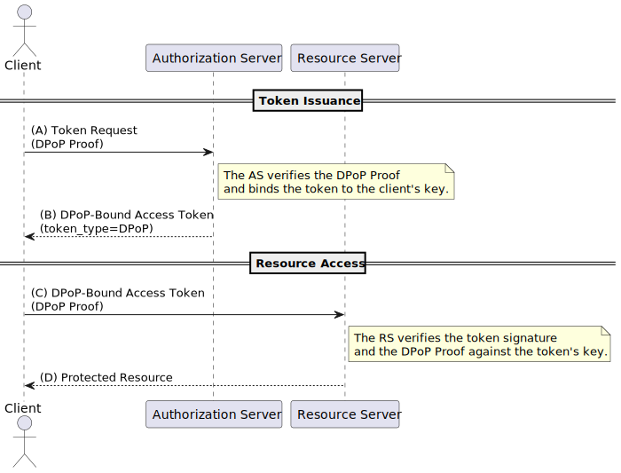
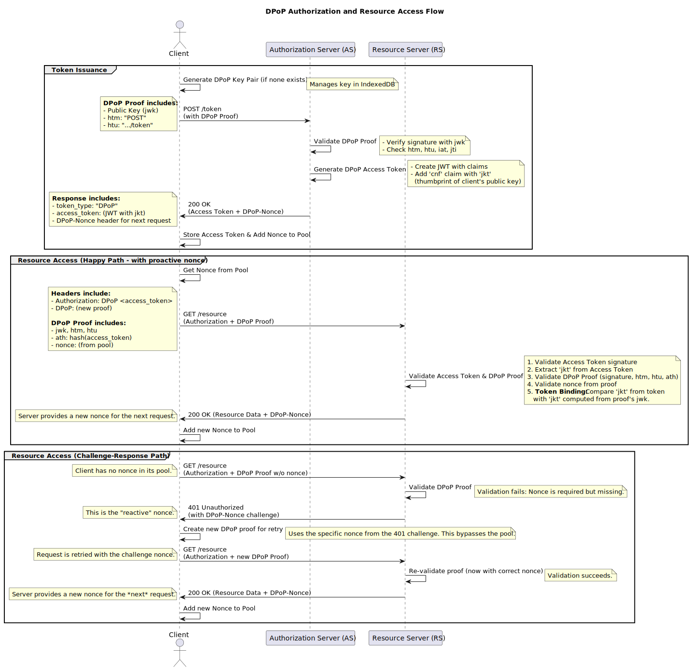

# PoC: DPoP

This repository is a proof of concept for [Demonstrating Proof-of-Possession][DPoP] (<abbr>
DPoP</abbr>). DPoP is a mechanism for sender-constraining OAuth 2.0 tokens via a proof-of-possession
mechanism on the application level. This mechanism allows for the detection of replay attacks with
access and refresh tokens.

## Overview

The PoC is made of a few files:

**main.go:** Implements a server-side demonstration of DPoP. It acts as both an **Authorization
Server** (issuing tokens from `/token`) and a **Resource Server** (protecting resources). It
features robust DPoP proof validation, JTI (JWT ID) replay prevention, a nonce challenge-response
mechanism, and generates access tokens that are cryptographically bound to a client's public key via
the [JKT][] thumbprint.

**index.ts:** Implements a comprehensive DPoP client. It handles the secure generation and
persistence of key pairs in **IndexedDB** and provides a `fetch` decorator that fully automates the
DPoP flow. This includes creating and signing DPoP [JWTs][JWT] with the required claims, and
managing a robust nonce strategy that uses a **proactive pool** to prevent challenges on new
requests while also handling the **reactive `401` challenge-response** flow for retries, ensuring
both efficiency and reliability.

**index.html:** A simple HTML page that demonstrates the PoC in action.

## Running the PoC

To run the PoC, clone the repository and run `go run main.go`. The server will start on port 8080.

The server exposes several endpoints:

- `/token`: The endpoint for obtaining a DPoP-bound access token.
- `/high-value-resource`: A resource endpoint that strictly requires a valid DPoP proof with a fresh
  nonce.
- `/low-value-resource`: A resource endpoint that strictly requires a valid DPoP proof but no
  nonce.

Open `index.html` in a browser and observe the console and network tabs to see the DPoP token
exchange.

### Explanation of the results

You will see the client first request an access token from `/token`. The server responds with a
DPoP-bound token (`dpop+jwt`) and also provides the first nonce in the `DPoP-Nonce` header. The
client adds this nonce to its proactive pool.

When the client makes a request to `/low-value-resource`, it is never challenged because the nonce
is not required.

When the client makes its first request to a resource (e.g., `/high-value-resource`), it pulls the
nonce from its pool and includes it in the DPoP proof. The request succeeds on the first try, and
the server provides a *new* nonce, which is added back into the pool. This demonstrates how the pool
prevents the need for a `401` challenge on every new request. The demonstration makes a batch of
calls to highlight that the nonce from the token request can only be used once. The remaining two
calls will be challenged.

The requests to `/high-value-resource` from the second batch won't be challenged because they
use the onces obtained after successful calls from the first batch.

From the Network panel, you can try resending requests. You'll see that any attempt will all fail
because their DPoP proof's `jti` was already used once, preventing replay attacks.

## DPoP Flow Diagram

Here is a sequence diagram illustrating the flow of a DPoP token exchange.

Here is a sequence diagram illustrating the complete flow implemented in this PoC, from token
issuance to resource access, including both the proactive "happy path" and the reactive
challenge-response path.

[DPoP]: https://datatracker.ietf.org/doc/html/rfc9449
[JKT]: https://datatracker.ietf.org/doc/html/rfc7638
[JWT]: https://www.jwt.io/introduction
