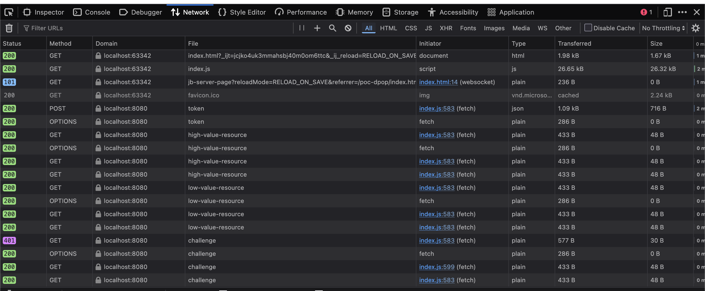

# PoC: DPoP

This repository is a proof of concept for [Demonstrating Proof-of-Possession][DPoP] (<abbr>
DPoP</abbr>). DPoP is a mechanism for sender-constraining OAuth 2.0 tokens via a proof-of-possession
mechanism on the application level. This mechanism allows for the detection of replay attacks with
access and refresh tokens.

## Overview

The PoC is made of a few files:

**main.go:** implements a server-side demonstration of DPoP token validation and issuance, featuring
logic for DPoP proof validation, JTI (JWT ID) replay prevention, nonce challenge-response, and
access token generation bound to the client's public key ([JKT][]).

**index.ts:** implements a **DPoP client-side library** that handles key generation and
persistence (using **IndexedDB**), canonical URL normalization, cryptographic signing of DPoP
[JWTs][JWT] (including [JKT][] binding, `ath`, `htm`, and `htu` claims), and provides a `fetch`
decorator that automatically manages the **DPoP-Nonce challenge-response flow** and token binding
for protected resource access.

**index.html:** a simple HTML page that demonstrates the PoC.

## Running the PoC

To run the PoC, clone the repository and run `go run main.go`. The server will start on port 8080.
The server exposes two resource endpoints: `/high-value-resource` and `/low-value-resource`. They
both require an access token, but `/high-value-resource` also requires a valid DPoP proof.

Open `index.html` in a browser to see the PoC in action. Check your browser's console and
network tabs to see the DPoP token exchange details. Your network tab should look similar to the
screenshot below.

Requests until the first `/challenge` should pass without issue because they use the nonce token
from previous successful requests. A DPoP-Nonce challenge is issued for the first `/challenge`
because the nonce token is not yet valid. After the request is retried and succeeds, a new nonce
token is available for the second `/challenge` request, which won't be challenged.

From the Network panel, you can try resending requests. You'll see that they will all fail because
their DPoP proof is no longer valid or their `jti` was already used once. That includes the request
for the access token.

Here's a diagram of the PoC flow:

[DPoP]: https://datatracker.ietf.org/doc/html/rfc9449
[JKT]: https://datatracker.ietf.org/doc/html/rfc7638
[JWT]: https://www.jwt.io/introduction